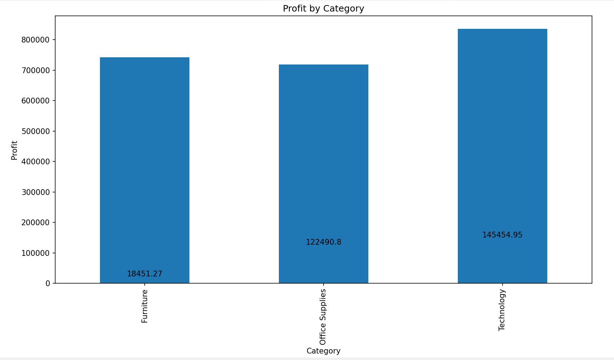
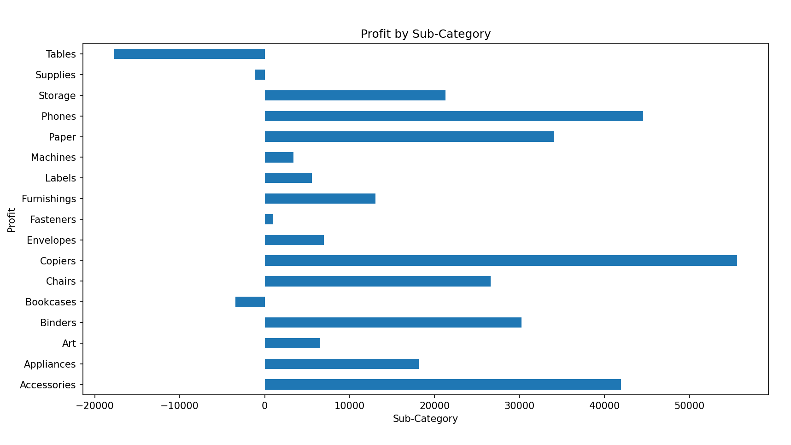
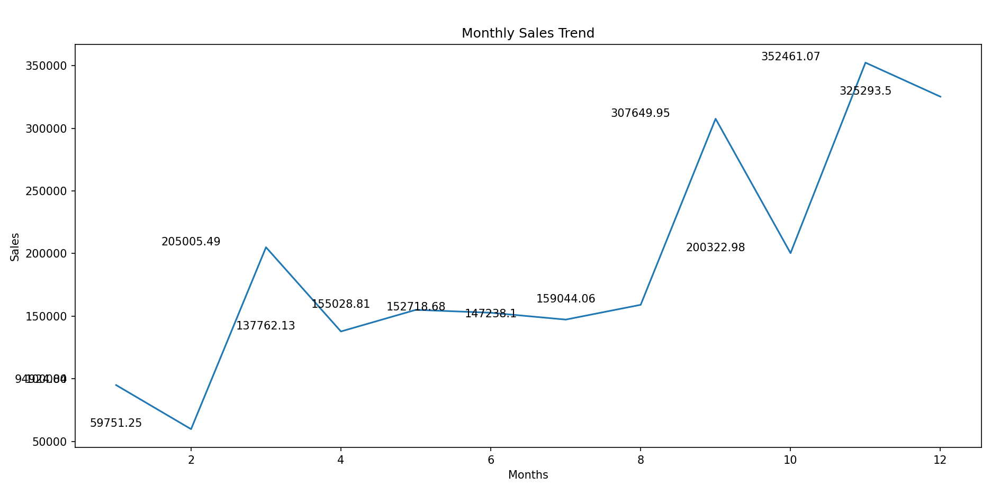
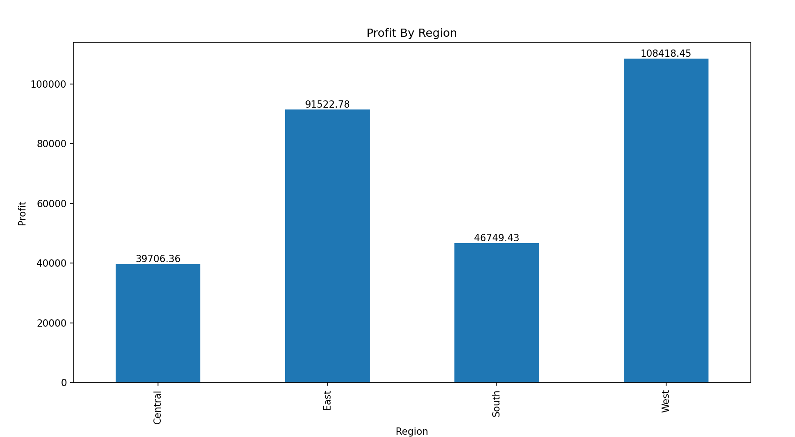
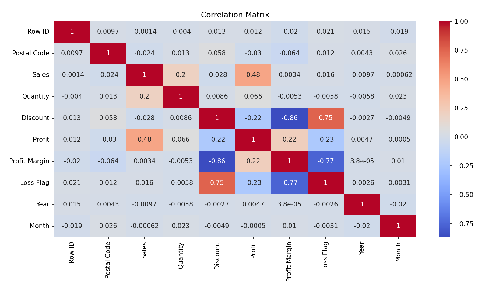
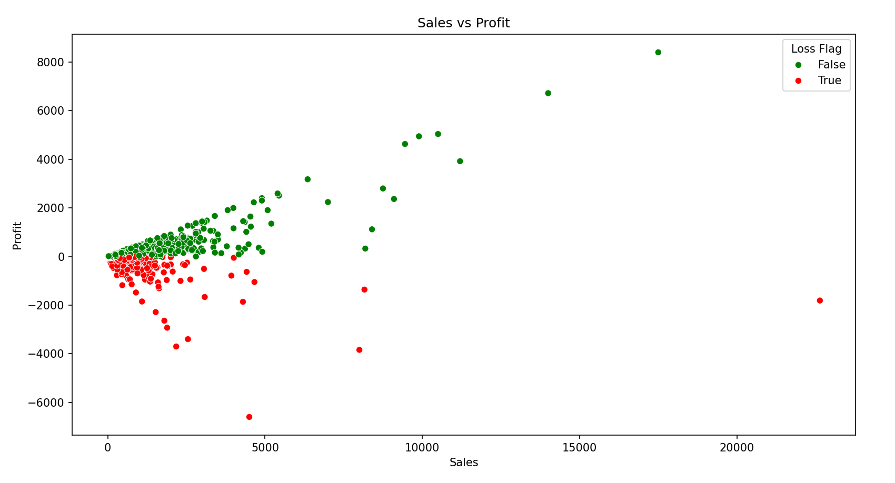
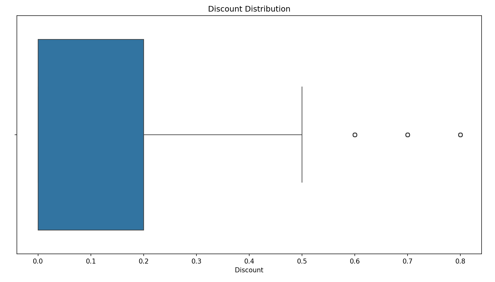
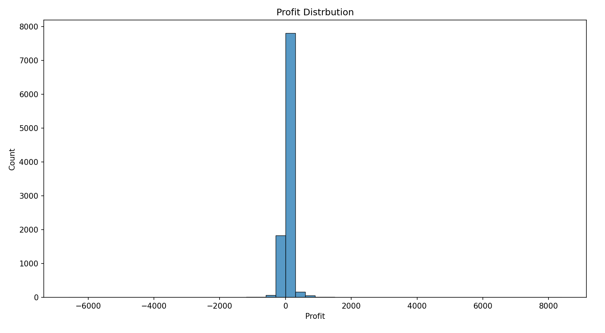

# Python Analysis – Retail Profit Leakage Analysis

This folder contains the Python-based analysis performed for the **Retail Profit Leakage Analysis** project.

Python was used for **data cleaning, feature engineering, and exploratory data analysis (EDA)** to understand patterns in sales, profit, discounts, and regional performance.

---

# Libraries Used

* pandas
* numpy
* matplotlib
* seaborn

These libraries were used for data manipulation, statistical analysis, and visualization.

---

# Project Workflow

The Python workflow consists of two major stages.

## 1. Data Cleaning & Preparation

The raw retail dataset was cleaned and prepared before performing analysis.

Key steps performed:

* Dataset loading
* Understanding dataset structure
* Missing value checks
* Duplicate record checks
* Date conversion
* Feature engineering

New columns created:

* **Profit Margin**
* **Loss Flag**
* **Year**
* **Month**

The cleaned dataset generated from this process is used for further analysis.

---

## 2. Exploratory Data Analysis (EDA)

Exploratory data analysis was performed to identify patterns related to **sales performance and profit leakage**.

The analysis includes:

* Category level performance
* Sub-category profitability
* Regional profit analysis
* Monthly sales trends
* Discount impact on profit
* Profit distribution patterns
* Correlation analysis

---

# Key Visualizations

## Sales by Category

---

## Profit by Category

---

## Profit by Sub-Category

---

## Monthly Sales Trend

---

## Profit by Region

---

## Discount vs Profit

---

## Correlation Matrix

---

## Sales vs Profit Relationship

---

## Profit Distribution

---

## Discount Distribution

---

# Key Insights from Python Analysis

* Technology category generates the highest profit among all categories.
* Certain sub-categories show lower or negative profitability.
* Higher discount levels are associated with reduced profit margins.
* Some regions generate strong sales but relatively lower profit.
* Profit distribution shows both highly profitable and loss-making transactions.

These insights help identify **potential sources of profit leakage in the retail business**.

