# Retail Profit Leakage Analysis

Retail Profit Leakage Analysis is an end-to-end data analytics project designed to identify areas where a retail business loses profit and to provide insights that can improve pricing, sales strategy, and operational efficiency.

This project demonstrates the complete data analytics workflow starting from raw data preparation to business intelligence dashboard development.

The analysis was performed using Python, SQL, Excel, and Power BI to uncover patterns related to profitability, discounts, customer behavior, and regional performance.

---

# Project Objective

Retail companies often generate high revenue but still experience low profitability due to factors such as excessive discounting, low-margin products, or inefficient regional performance.

The objective of this project is to:

* Identify products and categories causing profit leakage
* Analyze the impact of discount strategies on profit
* Understand customer purchasing behavior
* Evaluate regional sales and profitability
* Provide insights for improving pricing and sales strategy

---

# Dataset

The dataset used for this project is based on a retail sales dataset containing information about:

* orders
* customers
* products
* regions
* sales
* profit
* discounts

The dataset was first cleaned and prepared using Python before being analyzed in SQL, Excel, and Power BI.

---

# Tools & Technologies Used

Python

* Data cleaning
* Feature engineering
* Exploratory data analysis

SQL (PostgreSQL)

* Business queries
* profitability analysis
* customer analysis
* regional performance analysis

Microsoft Excel

* Pivot table analysis
* conditional formatting
* scenario modelling
* dashboard creation

Power BI

* interactive executive dashboard
* data visualization
* business insights

---

# Project Workflow

The project follows a complete analytics pipeline.

Raw Dataset
→ Python Data Cleaning
→ Python Exploratory Data Analysis
→ SQL Business Analysis
→ Excel Pivot Analysis & Dashboard
→ Power BI Executive Dashboard

This workflow demonstrates how raw business data can be transformed into meaningful insights and interactive dashboards.

---

# Python Analysis

Python was used to perform data cleaning and exploratory data analysis.

Key tasks performed:

* missing value checks
* duplicate detection
* feature engineering
* profit margin calculation
* loss flag identification
* sales trend analysis

Example analysis: Sales by Category

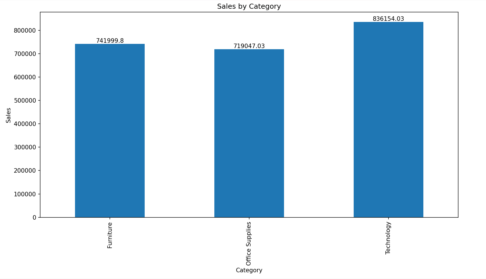

Example analysis: Profit by Region

Example analysis: Discount vs Profit relationship

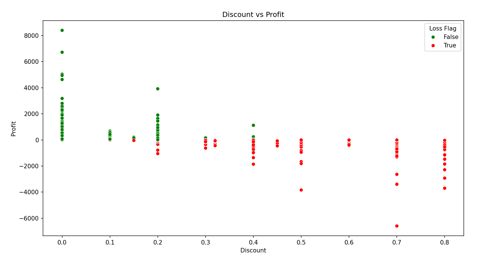

These analyses helped identify relationships between discount levels, sales performance, and profitability.

---

# SQL Business Analysis

SQL was used to perform business queries and profitability analysis.

Key queries included:

* total sales and total profit
* category performance
* sub-category profit analysis
* high sales but low profit products
* top customers by revenue
* regional profit ranking

Example SQL query result: Category Performance

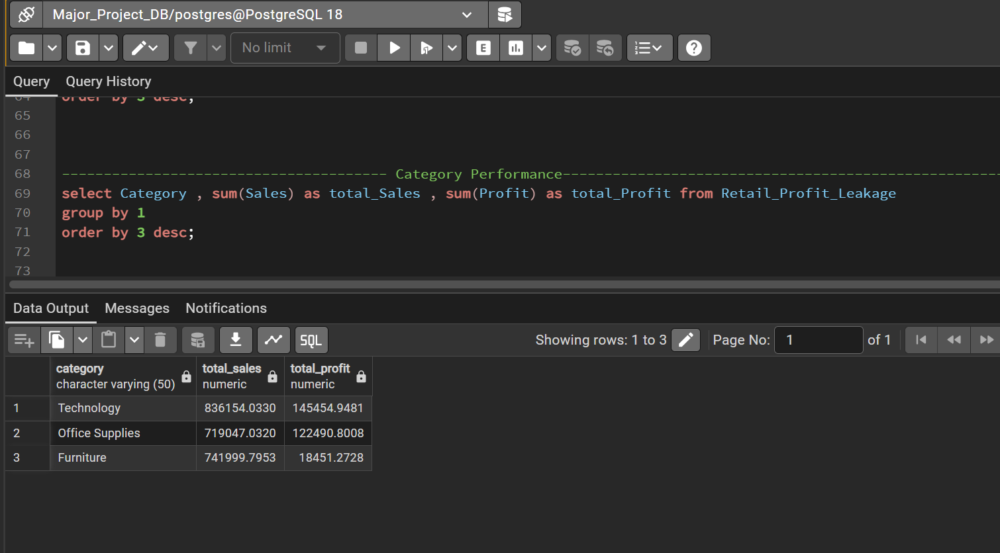

Example SQL analysis: Regional Profit Ranking

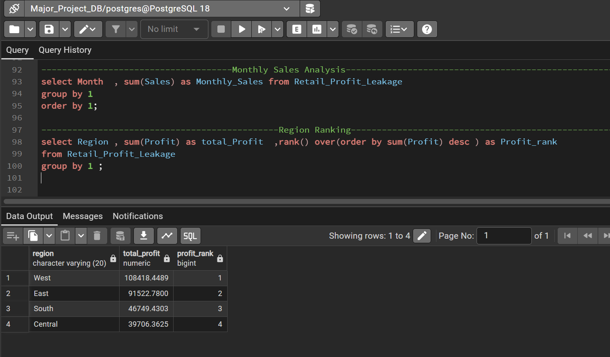

These SQL queries helped identify areas where profit leakage occurs.

---

# Excel Business Analysis

Excel was used to perform pivot-based analysis and scenario modelling.

Key Excel tasks included:

* sales by region pivot table
* profit by category analysis
* sub-category profitability analysis
* conditional formatting for loss detection
* monthly sales trend analysis
* pricing scenario modelling

Example Pivot Analysis

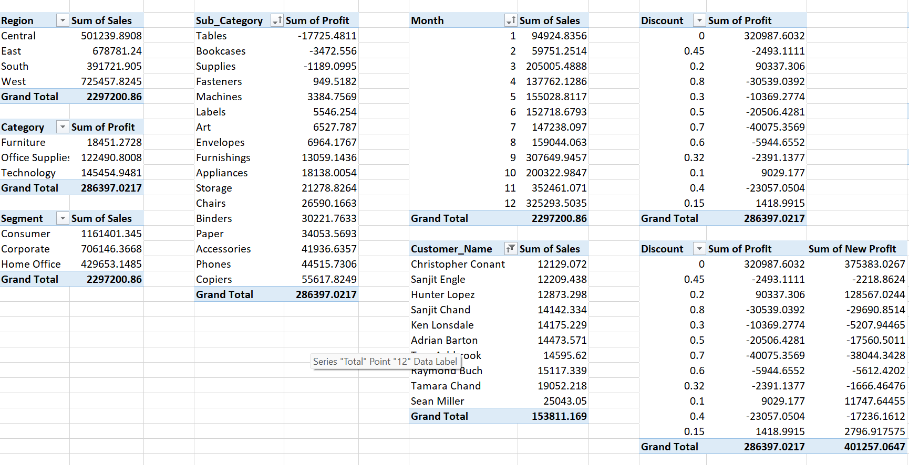

Example Conditional Formatting for Loss Detection

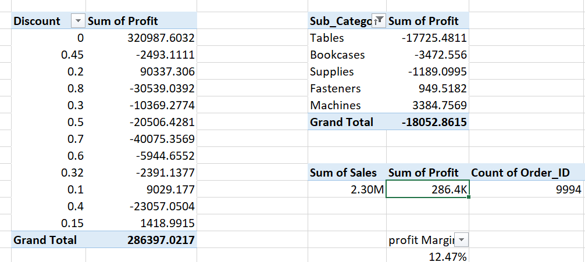

Example Excel Dashboard

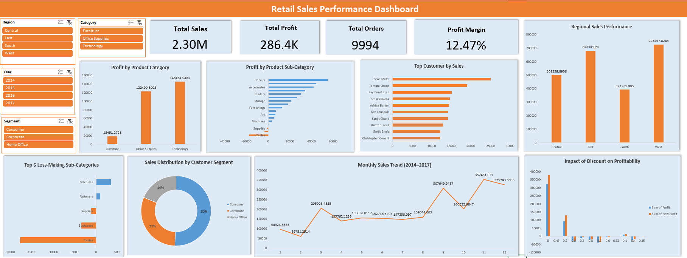

Excel helped provide quick business insights through pivot analysis and visual dashboards.

---

# Power BI Executive Dashboard

A four-page Power BI dashboard was created to visualize business performance.

Dashboard pages include:

Executive Overview
Profit Leakage Analysis
Customer Analysis
Regional Performance

Executive Dashboard

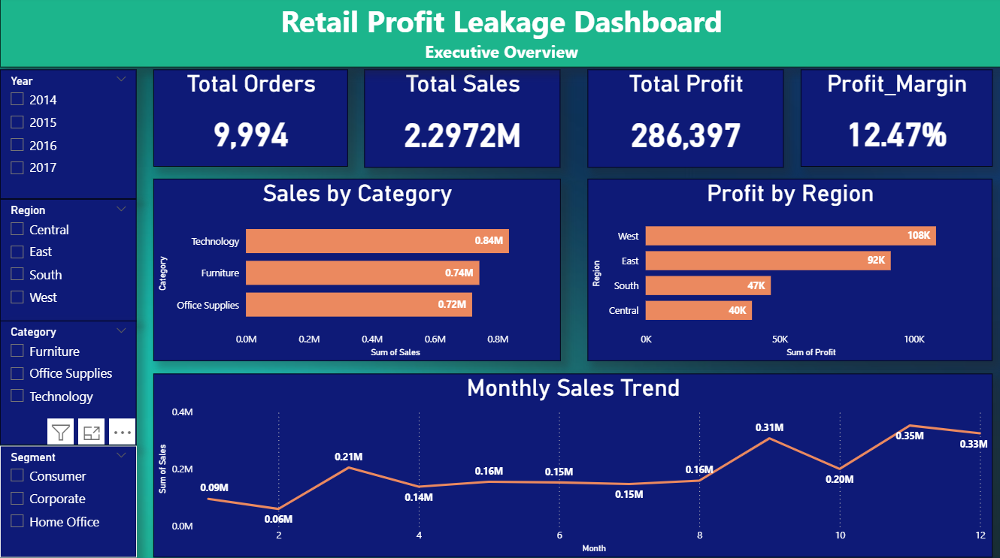

Profit Leakage Analysis

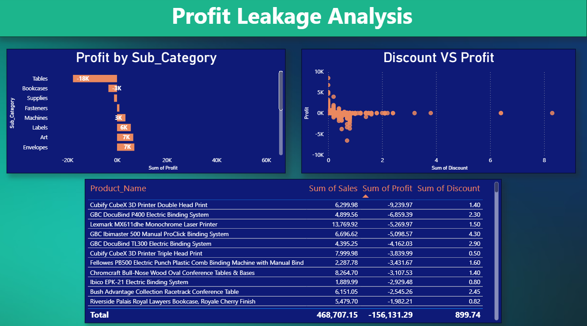

Customer Analysis

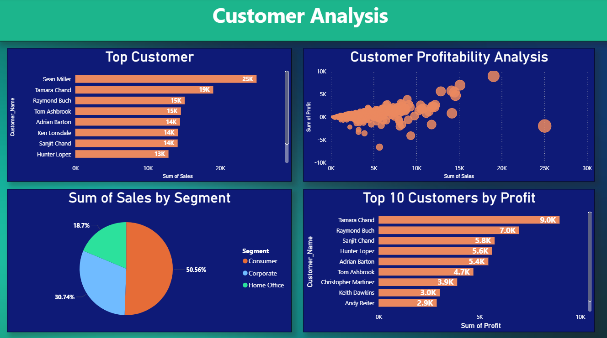

Regional Performance

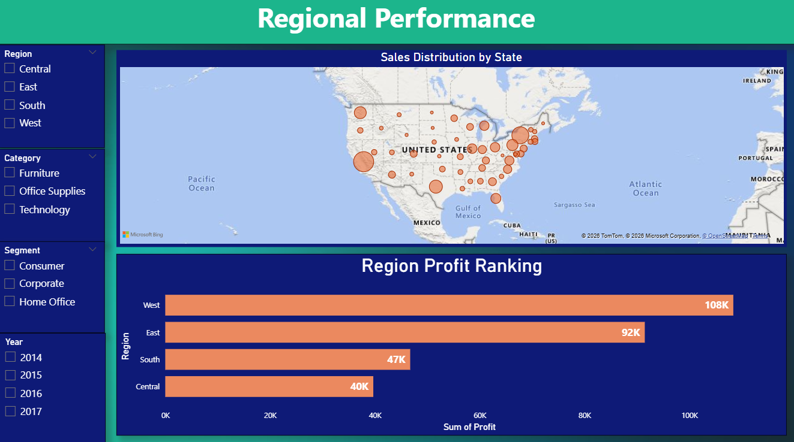

The Power BI dashboard provides an interactive view of sales performance, profitability patterns, and customer insights.

---

# Key Business Insights

The analysis revealed several important business insights:

* Certain sub-categories consistently generate losses
* Higher discount levels significantly reduce profitability
* Some products generate high sales but very low profit
* A small group of customers contributes a large share of revenue
* Some regions outperform others in terms of profitability
* Sales show seasonal trends across months

These findings highlight opportunities for improving pricing strategies, discount policies, and product portfolio decisions.

---

# Project Outcome

This project demonstrates how data analytics tools can be combined to transform raw business data into meaningful insights and interactive dashboards.

The end-to-end workflow illustrates how businesses can detect profit leakage, understand customer behavior, and make better data-driven decisions.

---

# Author

Data Analytics Project
Retail Profit Leakage & Growth Optimization

