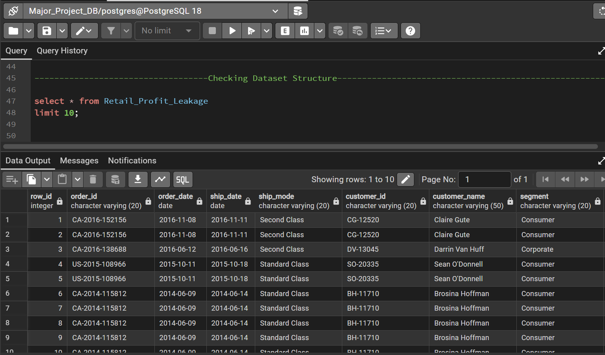
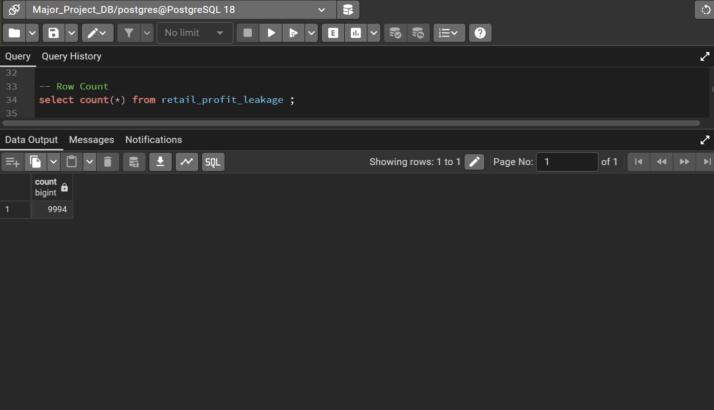
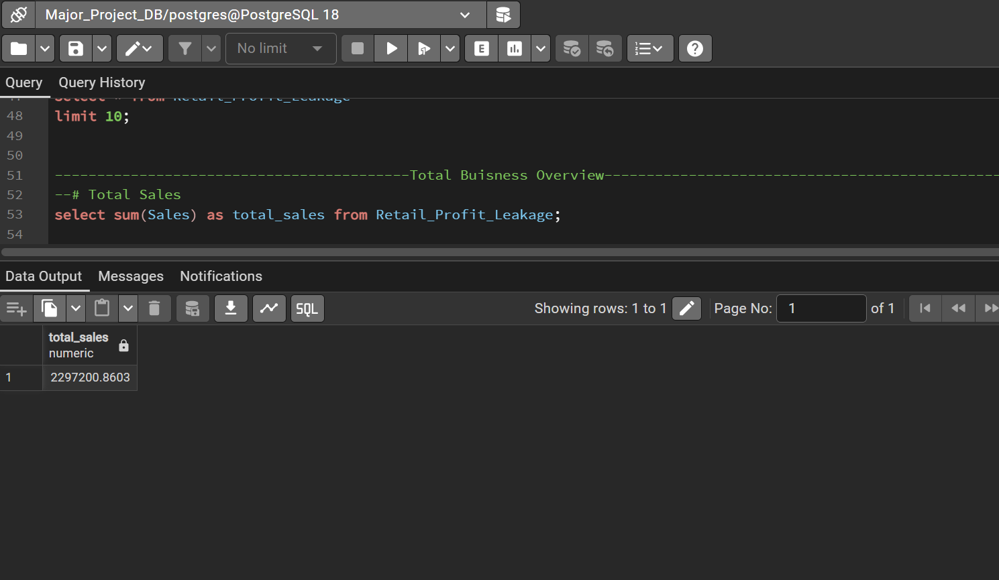
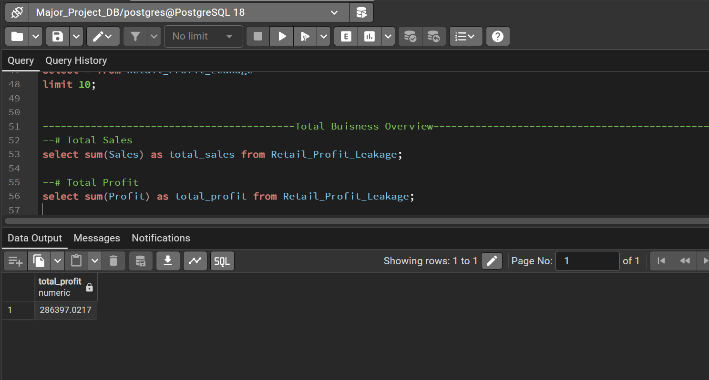
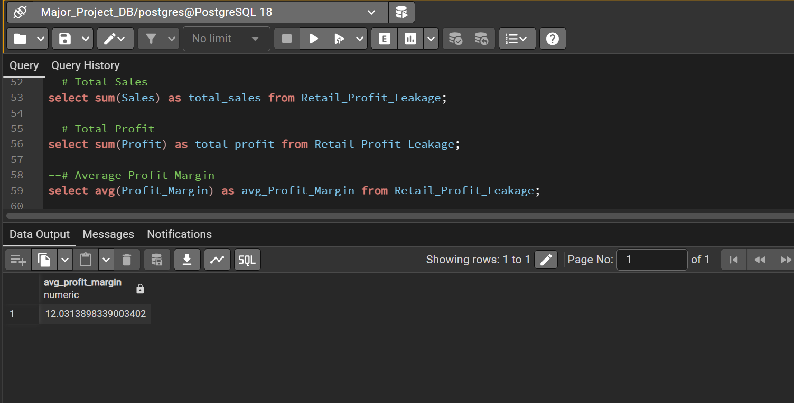
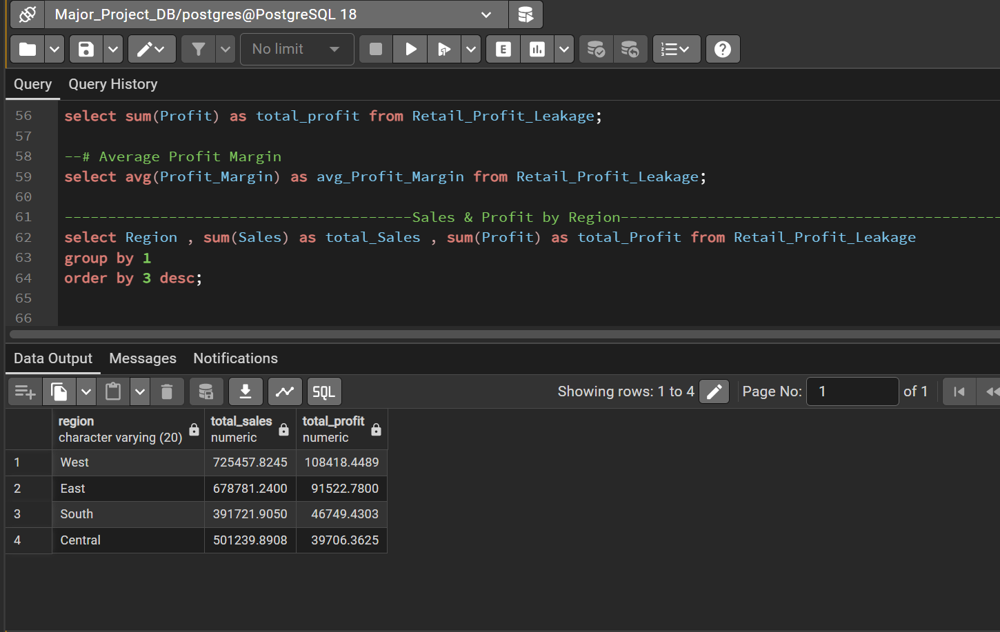
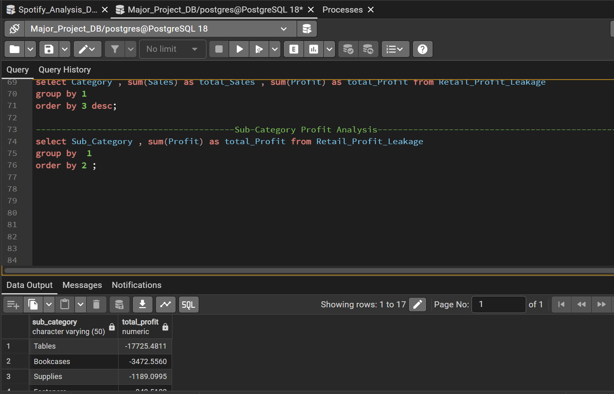
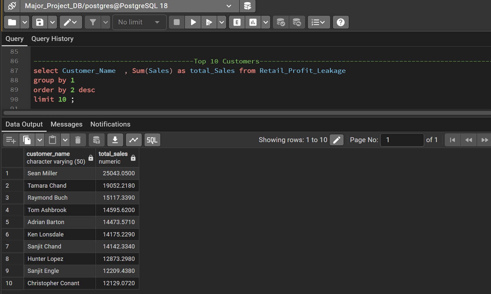
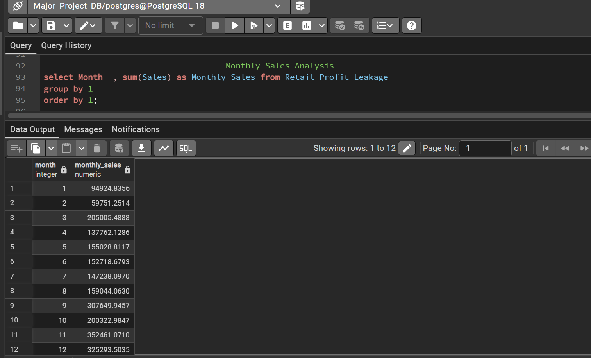
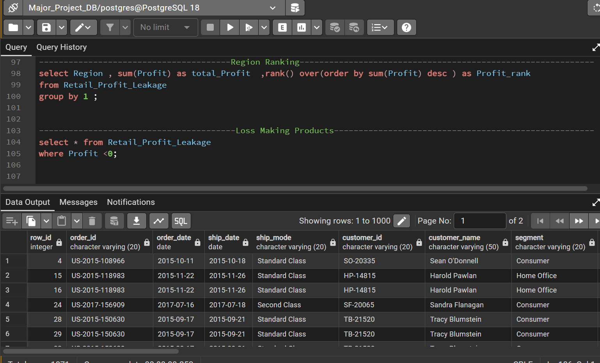

# Retail Profit Leakage Analysis (SQL)

This section of the project focuses on performing **SQL-based business analysis** on the cleaned retail dataset.

The analysis aims to identify **profit leakage, regional performance, product profitability, and customer insights** using SQL queries.

Database used: **PostgreSQL**

---

# Dataset Overview

Before starting the analysis, the dataset structure was explored.

## Dataset Preview

This step helps understand the columns and overall structure of the dataset.

---

# Row Count

Total number of records in the dataset.

**Insight**

The dataset contains **9,994 rows**, representing individual retail order transactions.

---

# Total Sales

SQL Query calculates the total sales generated by the business.

**Insight**

The business generated approximately **$2.29M in total sales**.

---

# Total Profit

**Insight**

Total profit generated is approximately **$286K**.

This shows that the overall business is profitable but margins need deeper investigation.

---

# Average Profit Margin

**Insight**

The average profit margin is around **12%**, indicating moderate profitability.

Further analysis is required to identify areas where profits are leaking.

---

# Sales & Profit by Region

**Insight**

- **West region generates the highest profit**
- **Central region has the lowest profitability**

This suggests potential **operational or pricing inefficiencies** in the Central region.

---

# Category Performance

**Insight**

- **Technology category generates the highest profit**
- **Furniture category shows significantly lower profit**

Furniture may contain products that contribute to **profit leakage**.

---

# Sub-Category Profit Analysis

**Insight**

Some sub-categories generate **negative profit**, such as:

- Tables
- Bookcases
- Supplies

These products may require **pricing optimization or discount control**.

---

# High Sales but Low Profit Products

**Insight**

Several products generate **high sales revenue but very low or negative profit**.

Possible reasons:

- excessive discounting  
- high cost of goods  
- inefficient pricing strategy

These products are key contributors to **profit leakage**.

---

# Top 10 Customers by Sales

**Insight**

A small number of customers generate a **significant portion of total revenue**, highlighting the importance of **customer retention strategies**.

---

# Monthly Sales Trend

**Insight**

Sales vary significantly across months, indicating possible **seasonal demand patterns**.

Understanding these patterns helps improve **inventory and marketing strategies**.

---

# Regional Profit Ranking

**Insight**

Regions ranked by total profit:

1️⃣ West  
2️⃣ East  
3️⃣ South  
4️⃣ Central  

Central region requires further investigation to improve profitability.

---

# Loss Making Orders

**Insight**

A significant number of orders generate **negative profit**, which indicates:

- aggressive discounting
- low margin products
- inefficient pricing strategy

Reducing these loss-making orders can significantly **improve overall profitability**.

---

# Key Business Findings

From the SQL analysis, several important insights were identified:

- Some **sub-categories consistently generate losses**
- **High discounts reduce profit margins**
- **Central region underperforms compared to other regions**
- Certain **products generate high sales but negative profit**
- A few **customers contribute significantly to total sales**

These insights highlight opportunities for **pricing optimization, discount control, and regional performance improvement**.

---

# Tools Used

- PostgreSQL
- SQL
- pgAdmin

---

# Project Connection

This SQL analysis is part of the complete project:

**Retail Profit Leakage & Growth Optimization**

The full project includes:

- Python (Data Cleaning & EDA)
- SQL (Business Analysis)
- Power BI (Interactive Dashboard)
