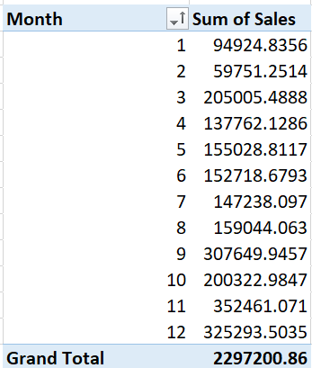

# Retail Profit Leakage Analysis – Excel

This section of the project focuses on performing **Excel-based business analysis** on the cleaned retail dataset. Excel was used to perform pivot-based analysis, profitability tracking, loss detection, and scenario modelling to evaluate the impact of pricing and discount strategies.

The dataset used for this analysis was generated after the **Python data cleaning process** and exported as:

clean_superstore.csv

This dataset was imported into Excel for further business analysis.

---

## Dataset Preparation

The cleaned dataset was first opened in Microsoft Excel and converted into an Excel Table using:

Ctrl + T

Converting the dataset into a table allows:

* easier filtering
* structured data management
* efficient pivot table creation
* faster data analysis

---

## Pivot Table Analysis

Several pivot tables were created to analyze sales and profit performance across different dimensions of the business.

### Sales by Region

A pivot table was created with:

Rows: Region
Values: Sales (Sum)

This analysis helps identify **which region generates the highest revenue**.

---

### Profit by Category

A pivot table was created with:

Rows: Category
Values: Profit (Sum)

This helps determine **which product category is the most profitable**.

---

### Sales by Segment

Customer segments analyzed:

* Consumer
* Corporate
* Home Office

Rows: Segment
Values: Sales

This helps identify **which customer segment contributes the most revenue**.

---

### Sub-Category Profit Analysis

A pivot table was created using:

Rows: Sub-Category
Values: Profit (Sum)

The results were sorted **from lowest to highest profit**.

This analysis helps detect **loss-making product groups that contribute to profit leakage**.

---

## Pivot Analysis Overview

The screenshot above shows the pivot tables used to analyze sales performance and profitability across different categories.

---

## Conditional Formatting – Loss Detection

Conditional formatting was applied to the **Profit column** in order to highlight negative profit values.

Rule applied:

Profit < 0

Negative values were highlighted using red formatting to quickly detect loss-making transactions.

This technique helps quickly identify:

* orders generating losses
* products causing profit leakage
* pricing inefficiencies

---

## Monthly Sales Trend Analysis

A pivot table was created to calculate total sales for each month.

Rows: Month
Values: Sales (Sum)

A **line chart** was then created to visualize monthly sales performance.

This chart helps identify **seasonality patterns and fluctuations in sales demand across different months**.

---

## Scenario Modelling (What-If Analysis)

Excel was used to simulate the impact of discount reduction on profitability.

Example formula used:

New Profit = Sales × (Profit Margin + 0.05)

This simulation estimates how profits could improve if discount levels are reduced by **5%**.

This type of analysis helps evaluate **pricing strategy optimization**.

---

## Additional Business Analysis

### Profit Margin Calculation

A new calculated column was created:

Profit Margin = Profit / Sales

This metric helps evaluate **product-level profitability efficiency**.

---

### Top 10 Customers Analysis

A pivot table was created with:

Rows: Customer Name
Values: Sales

The results were sorted from **largest to smallest**.

This helps identify **high-value customers contributing the most revenue**.

---

### Discount vs Profit Analysis

Pivot analysis was used to analyze how discount levels affect profitability.

A scatter chart was used to visualize the relationship between:

* Discount
* Profit

This analysis revealed that **higher discounts often lead to reduced profit margins**, indicating potential profit leakage due to aggressive discount strategies.

---

## Excel Dashboard

A mini Excel dashboard was created to provide a quick overview of business performance.

The dashboard includes the following KPIs:

* Total Sales
* Total Profit
* Profit Margin

Charts included in the dashboard:

* Sales by Region
* Profit by Category
* Monthly Sales Trend

The dashboard provides a **quick visual summary of overall business performance and profitability trends**.

---

## Key Business Insights

From the Excel analysis, several important insights were identified:

* Certain **sub-categories consistently generate losses**
* **High discount levels significantly reduce profitability**
* Some regions generate **higher profits compared to others**
* A small number of customers contribute a large share of total revenue
* Sales show **clear seasonal patterns across months**

These insights highlight potential opportunities for:

* pricing optimization
* discount strategy improvement
* product portfolio optimization
* regional performance improvement

---

## Tools Used

* Microsoft Excel
* Pivot Tables
* Conditional Formatting
* Excel Charts
* Scenario Modelling

---

## Project Integration

This Excel analysis is part of the full project:

**Retail Profit Leakage & Growth Optimization**

The complete project workflow includes:

Python → Data Cleaning & EDA
SQL → Business Analysis
Excel → Pivot Analysis & Dashboard
Power BI → Interactive Dashboard

