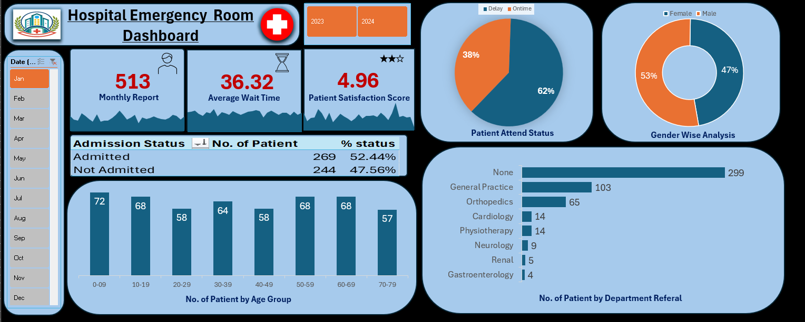

# 🏥 Hospital Emergency Room Analysis Dashboard (Excel)

## 📊 Project Overview

This project focuses on analyzing hospital emergency room patient data using Microsoft Excel.  
The goal is to build an interactive dashboard that helps healthcare stakeholders monitor patient flow, waiting time, and department referrals.

The dashboard provides insights that can help hospitals improve operational efficiency and patient satisfaction.

---

## 🎯 Business Objective

The main objective of this project is to analyze emergency room data and generate insights to support better decision-making in hospital management.

Key goals include:

- Monitor the number of patients visiting the emergency room
- Analyze average patient waiting time
- Track patient satisfaction score
- Understand admission vs non-admission rates
- Identify which departments receive the most referrals
- Analyze patient demographics such as age and gender

---

## 📌 Key Performance Indicators (KPIs)

The dashboard tracks the following important KPIs:

1. **Total Number of Patients**
   - Tracks the total number of patients visiting the emergency room.

2. **Average Wait Time**
   - Measures how long patients wait before receiving medical attention.

3. **Patient Satisfaction Score**
   - Tracks the average satisfaction rating given by patients.

4. **Admission Status**
   - Shows the number of patients admitted vs not admitted.

5. **Gender Analysis**
   - Displays male vs female patient distribution.

6. **Department Referrals**
   - Identifies which departments patients are referred to most frequently.

7. **Age Group Analysis**
   - Shows the distribution of patients across different age groups.

---

## 🛠 Tools & Technologies Used

- Microsoft Excel
- Power Query
- Power Pivot
- Pivot Tables
- Data Modeling
- Dashboard Design
- Data Visualization

---

## ⚙️ Project Workflow

The following steps were followed during the project development:

1. Business Requirement Gathering  
2. Understanding the Dataset  
3. Data Import using Power Query  
4. Data Cleaning and Quality Check  
5. Creating Calendar Table using Power Query  
6. Data Modeling using Power Pivot  
7. Creating Calculated Columns and Measures  
8. Building Pivot Tables  
9. Creating Charts and Visualizations  
10. Designing Interactive Dashboard  
11. Generating Business Insights

---

## 📈 Dashboard Insights

Some key insights from the dashboard:

- The emergency room handled **513 patients in the selected period**.
- The **average waiting time is 36.32 minutes**.
- The **average patient satisfaction score is 4.96**.
- **52.44% of patients were admitted**, while **47.56% were not admitted**.
- The **General Practice department received the highest referrals** after patients with no referral.
- Patient distribution is relatively balanced between **male and female patients**.

---

## 🖼 Dashboard Preview

---

## 📂 Project Files

Dataset and Excel dashboard are available in this repository.

---

## 🚀 Author

**Yasar Vazi**

Aspiring Data Analyst skilled in:

- SQL
- Excel
- Power BI
- Python
- Data Visualization
- Business Insights

