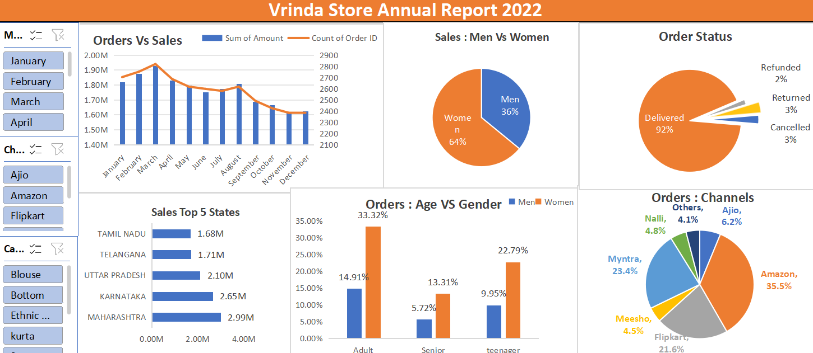
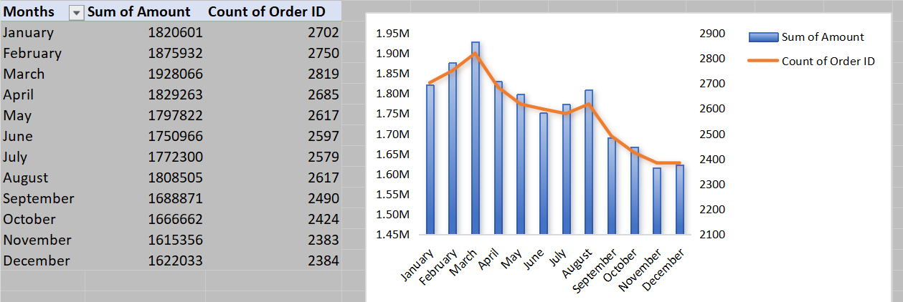
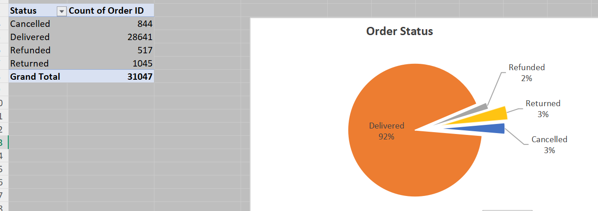

# 📊 Vrinda Store Sales Analysis (2022)

## 📌 Project Overview

This project focuses on analyzing the annual sales data of Vrinda Store for the year 2022. The goal is to uncover meaningful patterns, customer behavior, and business trends that support data-driven decision-making.

## 🎯 Objective

* Analyze monthly sales performance
* Identify top-performing states and sales channels
* Understand customer demographics (age & gender)
* Evaluate order status and delivery performance

## 🛠️ Tools & Technologies

* Microsoft Excel
* Pivot Tables
* Data Cleaning & Processing
* Interactive Dashboard

## 🔧 Data Cleaning & Processing

* Removed duplicate and missing values
* Standardized columns (Date, Gender, Age, Amount)
* Created calculated fields and pivot tables
* Structured data for visualization

## 📊 Dashboard Overview

## 📈 Orders vs Sales Trend

## 📦 Order Status Distribution

## 🔥 Key Insights

* Women contribute approximately **64%** of total sales
* Highest sales observed in **February and March**
* Amazon is the leading sales channel
* Maharashtra and Karnataka are top-performing states
* Over **90% orders successfully delivered**, indicating strong operations

## 📈 Business Insights

* Focus marketing campaigns during peak months (Jan–Mar)
* Target female customers for higher conversions
* Invest more in top-performing states
* Strengthen presence on Amazon and Myntra

## 📌 Conclusion

Vrinda Store’s performance in 2022 was driven by strong female customer engagement, early-year demand, and efficient order fulfillment. The business shows strong potential for growth by focusing on key regions and platforms.

## 🚀 Resume Line

Analyzed retail sales data using Excel, performed data cleaning, pivot analysis, and built an interactive dashboard to generate actionable business insights.
