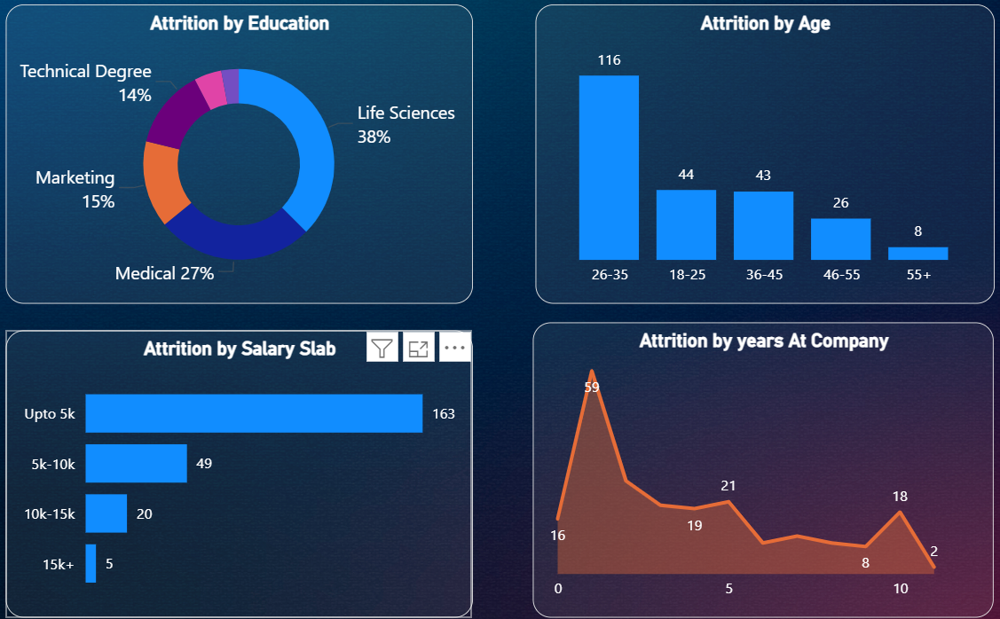
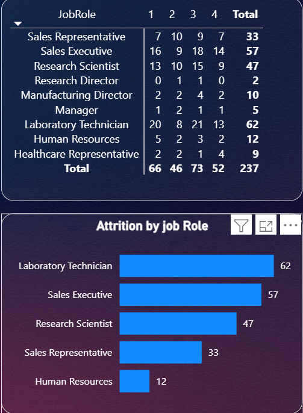

# 📊 HR Analytics Dashboard (Power BI)

## 📌 Project Overview

This project focuses on analyzing employee data to understand workforce trends and identify factors contributing to employee attrition. Using Power BI, an interactive dashboard was created to help HR teams monitor employee metrics and support data-driven decision-making.

The dashboard highlights key HR indicators such as attrition rate, department-wise employee distribution, and employee demographics.

---

## 🎯 Project Objectives

* Analyze employee attrition patterns
* Identify departments with high employee turnover
* Understand workforce demographics
* Provide insights to help HR improve employee retention

---

## 🛠 Tools & Technologies Used

* **Power BI** – Data visualization and dashboard creation
* **Data Analysis** – Workforce trend analysis
* **Data Cleaning** – Preparing HR dataset for analysis

---

## 📂 Dataset

The dataset contains employee information including:

* Employee ID
* Department
* Job Role
* Age
* Gender
* Salary
* Attrition Status

This dataset is used to analyze employee behavior and attrition trends.

---

## 📊 Dashboard Features

The HR Analytics dashboard includes:

* **Total Employees KPI**
* **Attrition Rate Analysis**
* **Department-wise Attrition**
* **Employee Demographics**
* **Salary and Attrition Relationship**

The dashboard allows HR teams to quickly identify workforce patterns and potential risk areas.

---

## 📈 Key Insights

* Higher attrition observed in certain departments.
* Employees in lower salary bands show higher turnover.
* Younger employees tend to leave more frequently.
* Workforce distribution varies significantly across departments.

---

## 📸 Dashboard Preview

---

## 📁 Project Files

* **HR_Analytics_Dashboard.pbix** – Power BI dashboard file
* **dataset.csv** – Raw dataset used for analysis
* **images/** – Dashboard screenshots

---

## 🚀 Future Improvements

* Add predictive analysis using Machine Learning
* Implement interactive filters for deeper HR insights
* Integrate real-time HR data sources

---

## 👤 Author

**Yasar Vazi**
Aspiring Data Analyst

Skills:
SQL | Python | Power BI | Excel | Data Analytics

