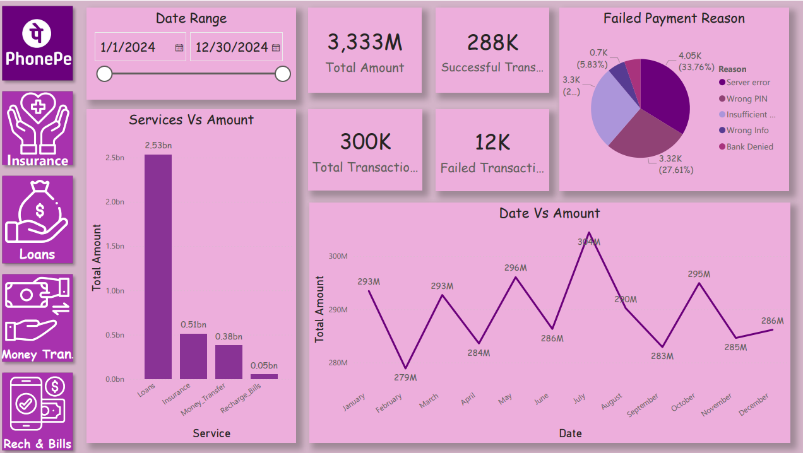
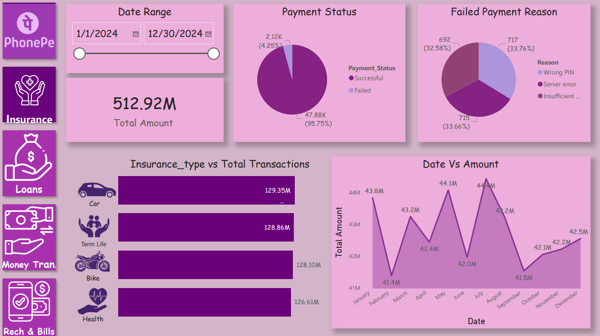
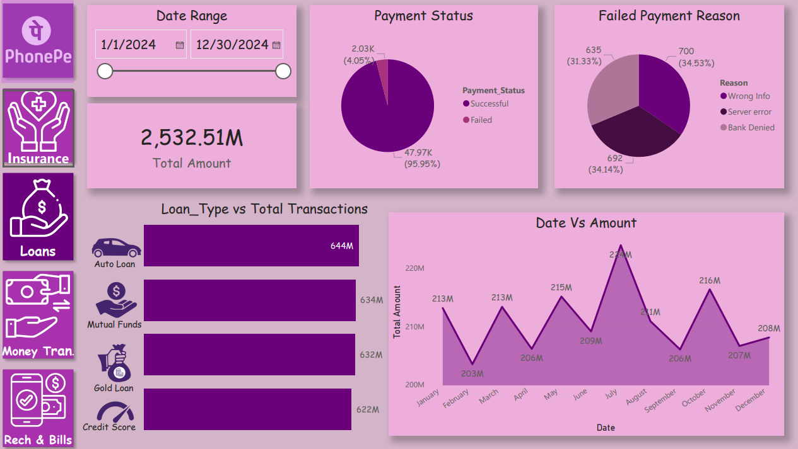
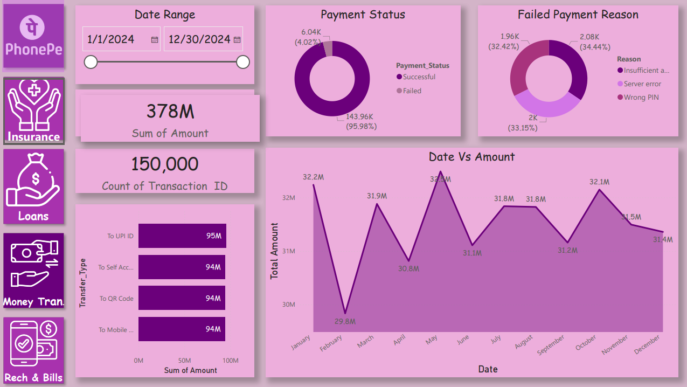
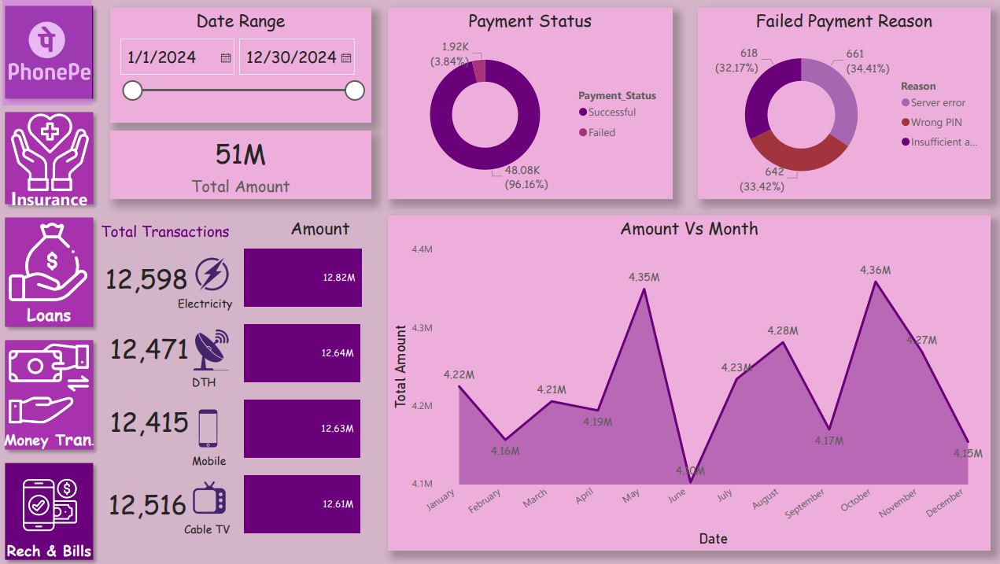

# PhonePe Transaction Analysis Dashboard

This project focuses on analyzing digital payment transactions using **Power BI** to understand transaction patterns, payment success rates, service usage, and failure reasons. The dashboard provides insights into how different services such as Insurance, Loans, Money Transfer, and Recharge & Bills perform across the platform.

The goal of the project is to transform raw transaction data into meaningful business insights using interactive visualizations and analytics.

---

## Project Overview

Digital payment platforms generate large volumes of transactional data every day. Analyzing this data can help businesses understand user behavior, identify transaction failures, and improve service performance.

This project analyzes PhonePe transaction data to uncover patterns in transaction volume, payment failures, service usage, and monthly transaction trends.

The analysis is performed using **Power BI**, enabling interactive exploration of payment performance and service-level insights.

---

## Dataset Description

The dataset used for this project contains transactional data related to digital payments. It includes information about transaction amount, payment status, services used, failure reasons, and transaction dates.

Key attributes in the dataset include:

* Transaction ID
* Date of transaction
* Transaction amount
* Payment status (Successful / Failed)
* Service category
* Failure reason
* Transaction type

The dataset allows analysis of both **successful and failed transactions**, making it possible to identify operational issues and service performance patterns.

---

## Tools & Technologies Used

Power BI
Data Visualization
Business Intelligence
Data Analysis

Power BI was used to build an interactive dashboard that highlights key payment metrics and trends.

---

## Dashboard Overview

The dashboard provides a comprehensive view of digital payment performance, including key business metrics and service-level insights.

Main metrics included in the dashboard:

* Total Transaction Amount
* Total Transactions
* Successful Transactions
* Failed Transactions

These metrics help monitor the overall health of the payment system.



---

## Insurance Transactions Analysis

The insurance section of the dashboard analyzes payment transactions related to insurance services. It shows how insurance payments vary across months and identifies the most common reasons for failed payments.

Key insights analyzed:

* Monthly transaction trends for insurance payments
* Payment success vs failure ratio
* Insurance type transaction distribution
* Failure reasons such as wrong PIN, server errors, or insufficient balance



---

## Loan Transactions Analysis

The loan services dashboard focuses on financial transactions related to loan products. It analyzes payment behavior and helps understand which loan types generate the highest transaction volume.

Key analysis areas include:

* Total loan transaction amount
* Monthly transaction trends
* Loan type transaction distribution
* Payment success vs failure rate



---

## Money Transfer Analysis

Money transfer is one of the most frequently used digital payment services. This section of the dashboard analyzes transaction patterns for peer-to-peer transfers and identifies failure reasons affecting successful payments.

Key insights include:

* Total amount transferred across the platform
* Monthly transaction trends
* Payment success rate
* Transfer type distribution such as transfers to UPI ID, QR code, mobile number, or bank account



---

## Recharge & Bills Analysis

This section focuses on bill payments and recharge services such as electricity, mobile recharge, cable TV, and DTH services.

The dashboard helps analyze:

* Total recharge and bill payment transactions
* Monthly payment trends
* Service-wise payment distribution
* Payment success vs failure ratio



---

## Key Insights

The analysis reveals several important insights about digital payment behavior:

* Money Transfer generates the highest transaction volume among all services.
* Most transactions across services are successful, indicating strong payment reliability.
* Failed transactions are primarily caused by server errors, incorrect PIN entry, or insufficient balance.
* Monthly transaction amounts remain relatively consistent throughout the year with slight fluctuations.
* Loan and insurance services contribute significant transaction amounts compared to other services.

These insights help identify areas where payment systems can be optimized and failure rates can be reduced.

---

## Business Impact

Analyzing digital payment transactions provides valuable insights for improving financial technology platforms.

The dashboard helps:

* Monitor payment system performance
* Identify major causes of transaction failures
* Understand user transaction behavior
* Analyze service-level usage patterns
* Support data-driven decision making for digital payment platforms

---

## Project Structure

```text
PhonePe-Transaction-Analysis
│
├── dataset
│     phonepe_dataset.csv
│
├── powerbi
│     phonepe_dashboard.pdf
│
├── images
│     dashboard_overview.png
│     insurance_dashboard.png
│     loans_dashboard.png
│     money_transfer_dashboard.png
│     recharge_bills_dashboard.png
│
├── assets
│
└── README.md
```

---

## Conclusion

This project demonstrates how transaction data from digital payment platforms can be analyzed using business intelligence tools to uncover valuable insights.

By combining data visualization techniques with interactive dashboards, the project provides a clear understanding of payment performance, service usage trends, and operational issues that affect transaction success rates.

The dashboard enables decision-makers to monitor payment performance and identify opportunities for improving the reliability and efficiency of digital financial services.

