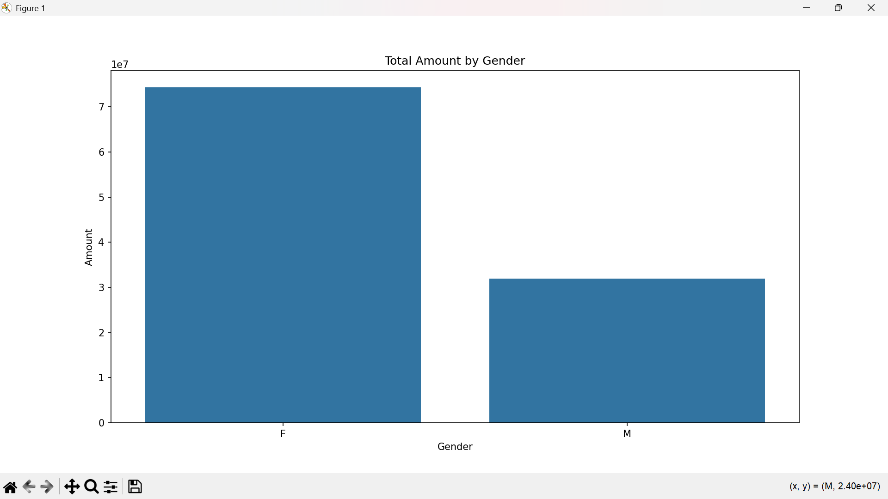
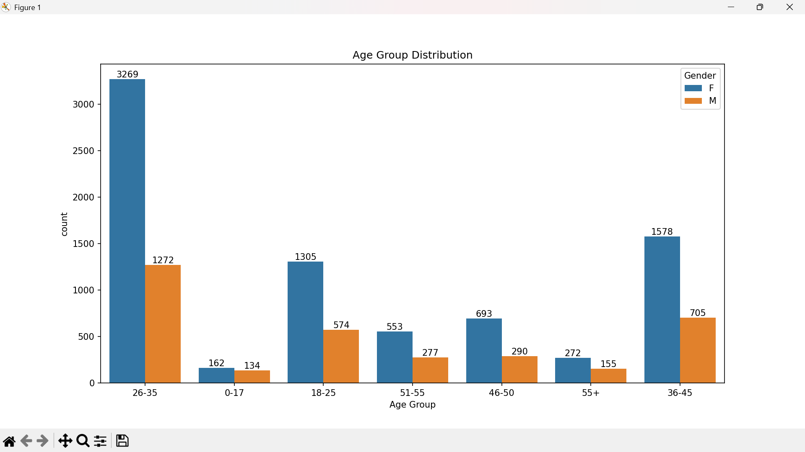
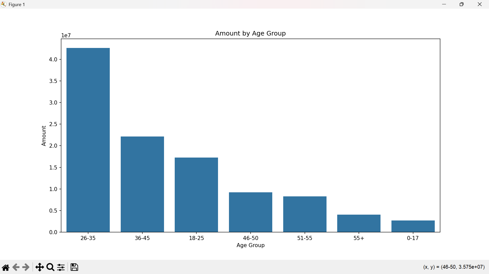
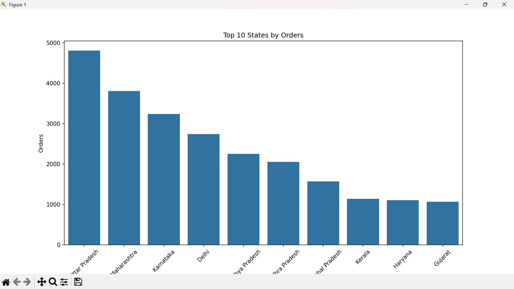
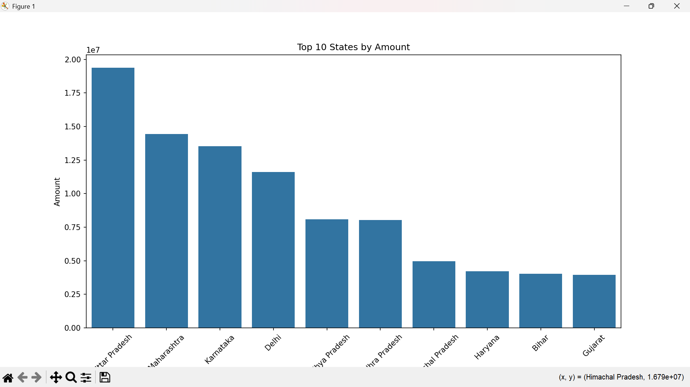
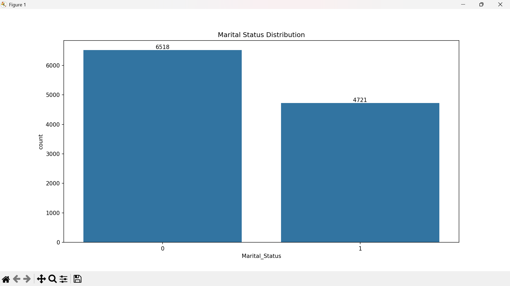

# 🎆 Diwali Sales Data Analysis (Python Project)

## 📌 Project Overview

This project focuses on analyzing Diwali sales data to understand customer purchasing behavior and identify key factors driving sales during the festive season. The analysis helps businesses make data-driven decisions for targeted marketing and revenue growth.

---

## 🎯 Objective

* Analyze customer purchase patterns during Diwali
* Identify high-value customer segments
* Determine top-performing states and product categories
* Understand the impact of gender, age, and occupation on sales

---

## 🛠️ Tools & Technologies

* Python
* Pandas
* NumPy
* Matplotlib
* Seaborn

---

## 🔧 Data Cleaning & Preprocessing

* Removed unnecessary columns (`Status`, `unnamed1`)
* Handled missing values using `dropna()`
* Converted `Amount` column to integer type
* Verified dataset using `info()` and `describe()`

---

## 📊 Exploratory Data Analysis

### 👥 Gender Distribution

### 💰 Sales by Gender

### 👨‍👩‍👧 Age Group Distribution

### 💸 Sales by Age Group

### 🗺️ Top States by Orders

### 💵 Top States by Sales Amount

### 💍 Marital Status Distribution

---

## 🔥 Key Insights

* Female customers contribute significantly more to total sales
* Age group **26–35** is the most active and high-spending segment
* Top states driving revenue are **Uttar Pradesh, Maharashtra, and Karnataka**
* Married women have higher purchasing power during the festive season
* Customers working in IT, Healthcare, and Aviation sectors show higher spending trends
* Top product categories include **Food, Clothing, and Electronics**

---

## 📈 Business Insights

* Target **women aged 26–35** for maximum conversion
* Focus marketing campaigns in high-performing states
* Promote top-selling categories during festive seasons
* Design personalized offers for working professionals
* Launch combo deals and festive discounts for high-value customers

---

## 📌 Conclusion

The analysis reveals strong customer segmentation patterns during Diwali. Businesses can leverage these insights to design targeted marketing campaigns, optimize inventory, and increase festive season revenue. Data-driven strategies can significantly enhance profitability.

---

## 🚀 Resume Line

Analyzed festive season sales data using Python, performed data cleaning, exploratory data analysis, and created visualizations to extract actionable business insights for business growth.

