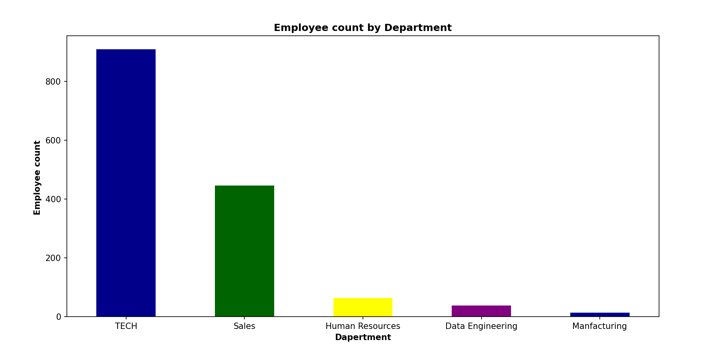
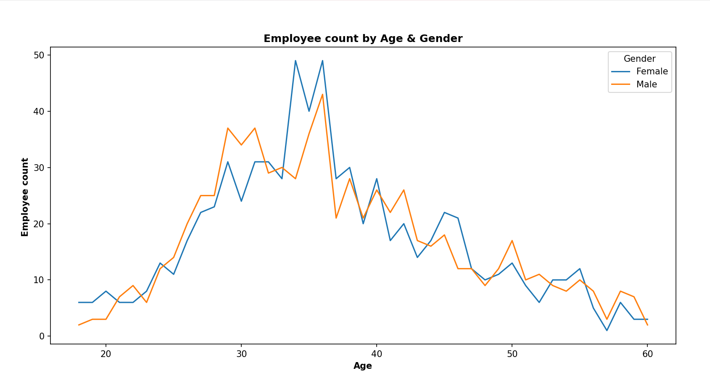
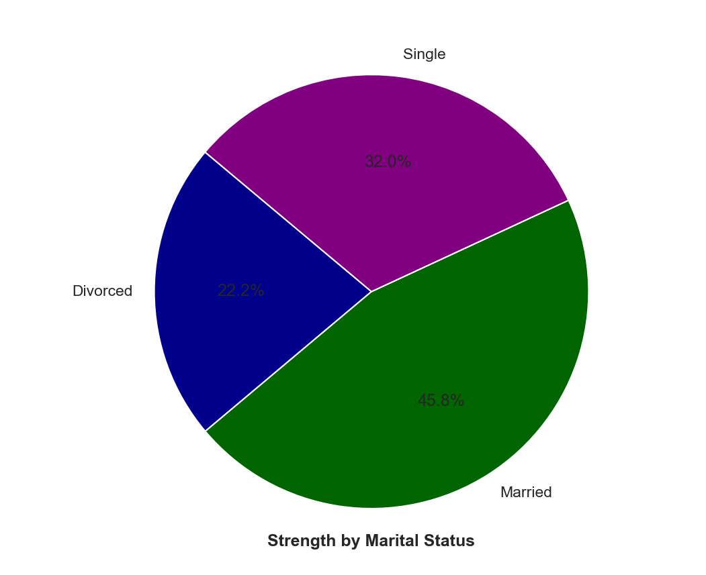
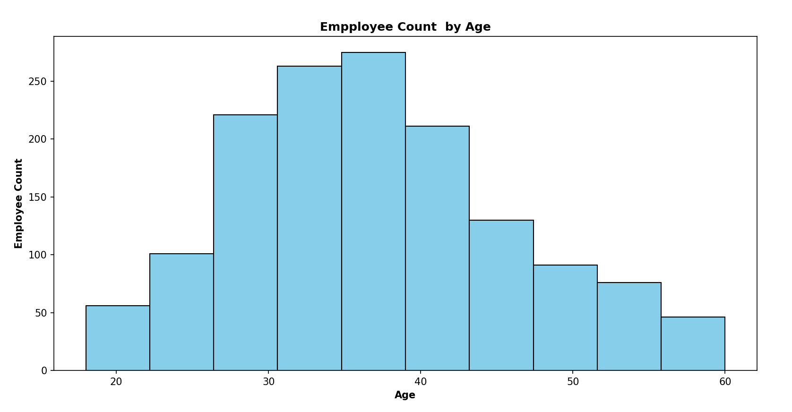
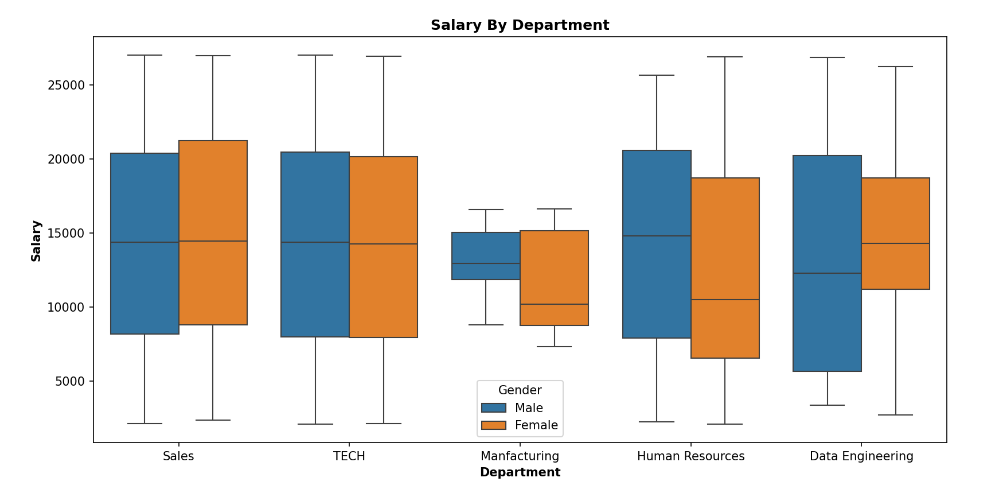

# HR Data Analysis (Python)

## 📊 Project Overview
This project performs Exploratory Data Analysis (EDA) on an HR dataset to understand workforce distribution, employee demographics, salary patterns, and departmental insights.

The analysis was conducted using Python libraries such as Pandas, NumPy, Matplotlib, and Seaborn to clean the data, analyze employee information, and visualize key workforce trends.

---

## 🛠 Tools & Libraries Used

- Python
- Pandas
- NumPy
- Matplotlib
- Seaborn
- Jupyter Notebook / Python Script

---

## 📂 Dataset Information

The dataset contains employee information including:

- Employee Name
- Age
- Gender
- Department
- Hire Date
- Marital Status
- Salary (MonthlyRate)

---

## 🔎 Data Cleaning & Preparation

The following preprocessing steps were performed:

- Removed duplicate records
- Handled missing values in **Age** and **Department**
- Standardized gender values (M → Male, F → Female)
- Created **Full Name** column
- Calculated **Years At Company** from Hire Date
- Structured dataset for analysis

---

## 📈 Data Visualizations

### 1️⃣ Employee Count by Department

This chart shows the distribution of employees across different departments.

---

### 2️⃣ Employee Count by Age & Gender

This line chart analyzes how employee counts vary across different age groups and genders.

---

### 3️⃣ Workforce Distribution by Marital Status

This pie chart illustrates the marital status distribution of employees.

---

### 4️⃣ Average Salary by Department and Gender

This bar chart compares average salary across departments and genders.

---

### 5️⃣ Employee Age Distribution

This histogram shows the distribution of employees across age groups.

---

### 6️⃣ Salary Distribution by Department

This boxplot visualizes salary variations across departments and genders.

---

## 💡 Key Insights

- The **Technology department** has the highest number of employees.
- Most employees fall within the **30–40 age group**, indicating a mid-career workforce.
- **Married employees represent the largest portion** of the workforce.
- Salary distribution varies significantly across departments.
- Some departments show noticeable salary variation between genders.
- Manufacturing department shows comparatively **lower average salary levels**.

---

## 📌 Conclusion

This HR Data Analysis project demonstrates how Python-based data analysis can uncover important workforce insights.

By analyzing employee demographics, department distribution, salary trends, and workforce characteristics, organizations can better understand employee structure and support data-driven HR decision-making.

---

## 📁 Project Structure

---

## 👨‍💻 Author

**Yasar Vazi**

Aspiring Data Analyst  
Skills: SQL | Python | Power BI | Excel | Data Visualization
