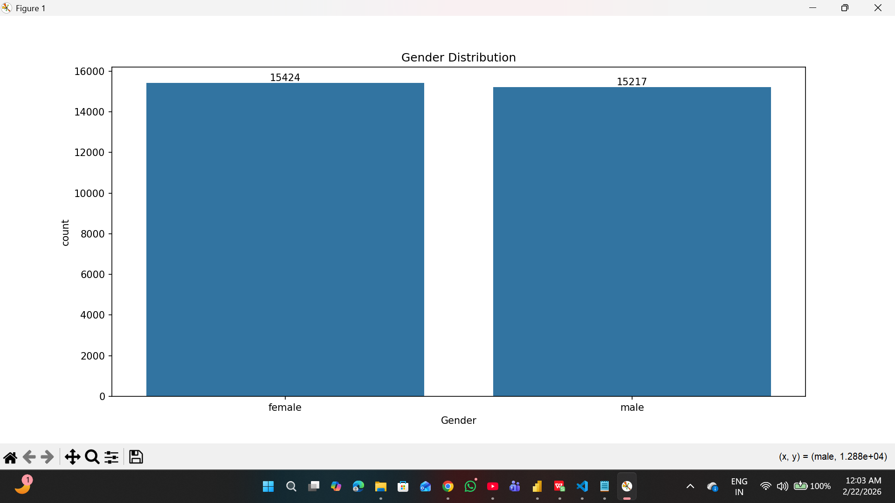
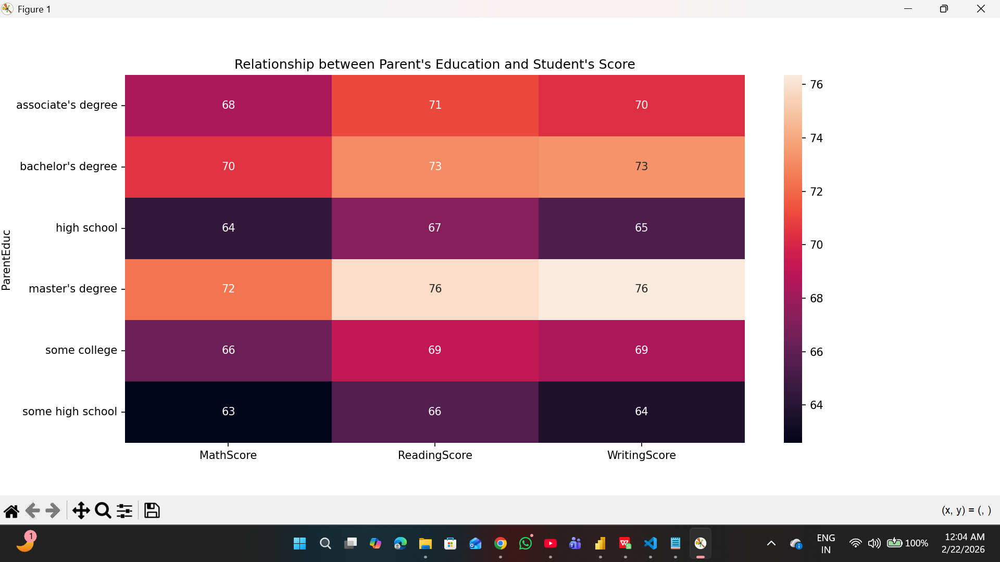
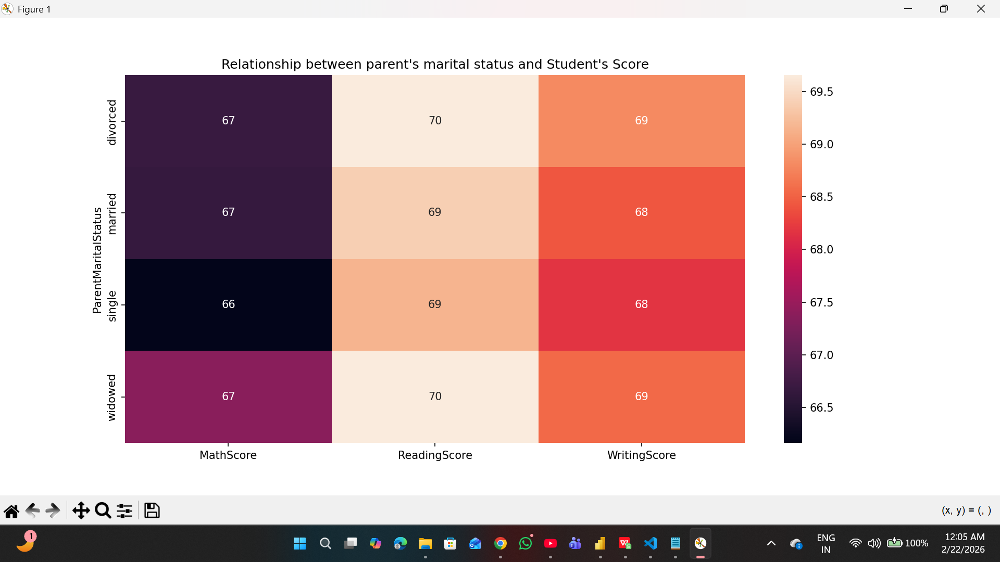
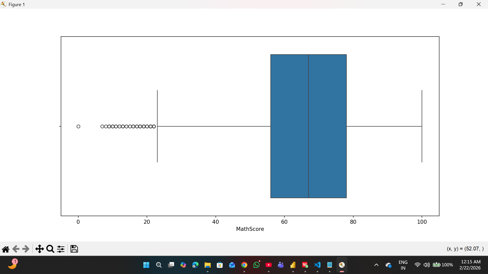
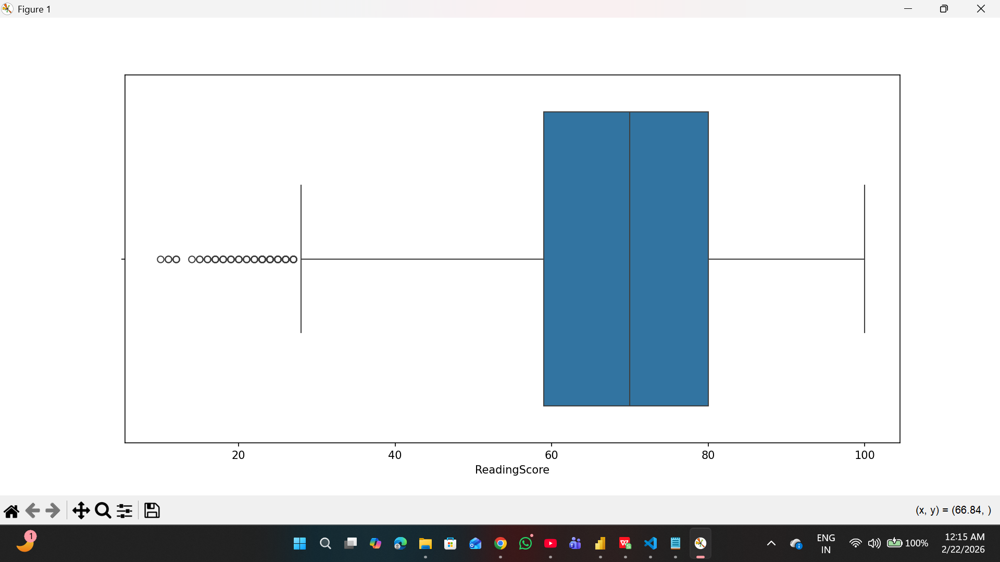
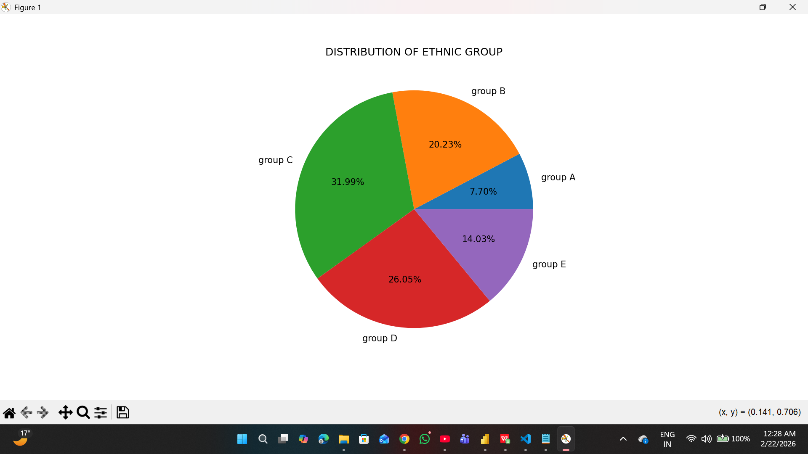

# 📊 Student Score Analysis (Python Project)

## 📌 Project Overview

This project analyzes student academic performance using Python. It explores how factors such as gender, parental education, marital status, and ethnicity influence student scores in Math, Reading, and Writing.

## 🎯 Objective

* Analyze student performance across subjects
* Understand impact of parental background
* Identify score distribution and outliers
* Extract meaningful insights from data

## 🛠️ Tools & Libraries

* Python
* Pandas
* NumPy
* Matplotlib
* Seaborn

## 🔧 Data Cleaning & Processing

* Checked dataset structure using `shape()`, `info()`, `describe()`
* Handled missing values
* Removed unnecessary column (`Unnamed: 0`)
* Standardized "WklyStudyHours" values
* Prepared dataset for analysis

## 📊 Visualizations

### 👥 Gender Distribution

### 🎓 Parent Education vs Scores

### 💍 Parent Marital Status vs Scores

### 📈 Score Distribution (Boxplots)

### 🌍 Ethnic Group Distribution

## 🔥 Key Insights

* Female students slightly outnumber male students
* Students with highly educated parents perform better
* Parental marital status has minimal impact on scores
* Most scores lie between 65–75 range
* Ethnic Group C has highest representation

## 📈 Conclusion

Parental education plays a significant role in student performance, while marital status has negligible impact. Overall performance is stable with limited extreme outliers.

## 🚀 Resume Line

Analyzed student performance data using Python, performed data cleaning, exploratory data analysis, and created visualizations to derive actionable insights.

